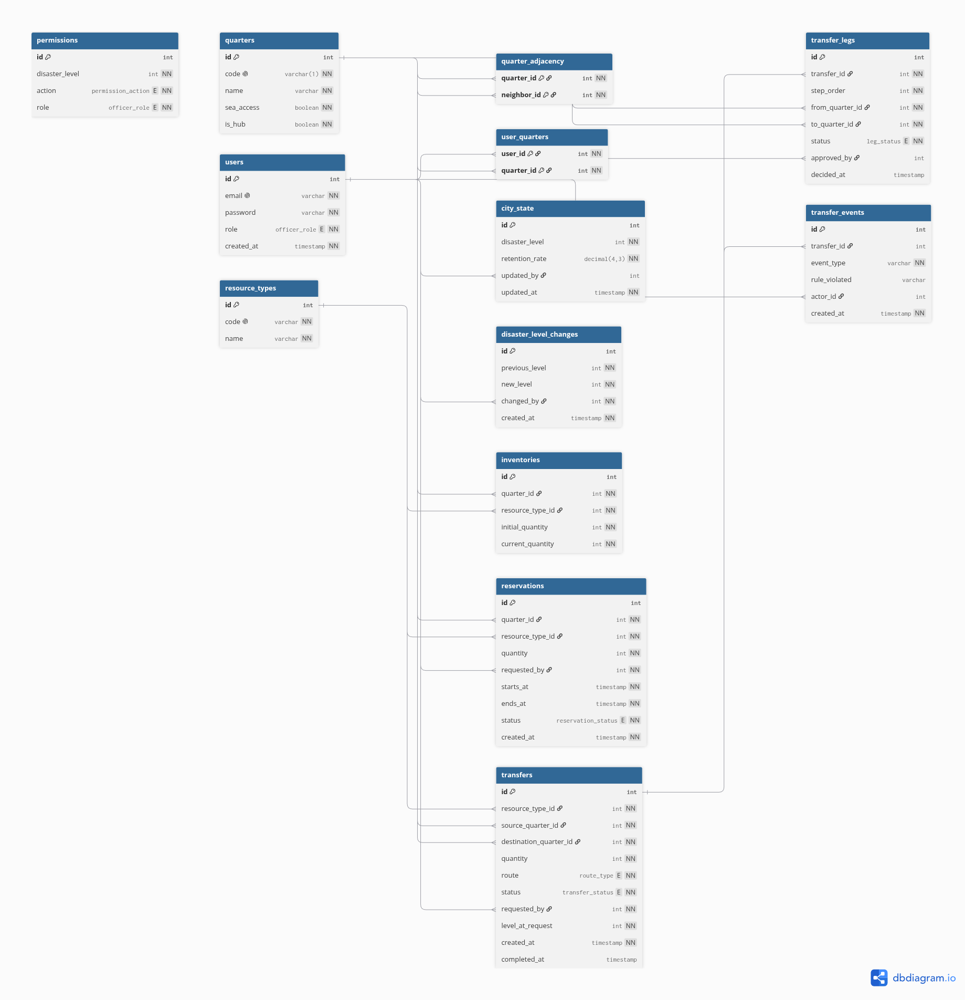

# Explication Backend Kaiju

## Arborescence :

```
.
├── db
│   ├── migrations
│   │   └── schema.sql
│   └── seeds
│       └── init.sql
├── docker-compose.yml
├── Dockerfile
├── package.json
├── README.md
├── src
│   ├── app.ts
│   ├── config
│   │   └── database.ts
│   ├── controllers
│   │   ├── auth.controller.ts
│   │   ├── disaster.controller.ts
│   │   ├── inventory.controller.ts
│   │   └── transfer.controller.ts
│   ├── middlewares
│   │   ├── auth.middleware.ts
│   │   └── permission.middleware.ts
│   ├── routes
│   │   ├── auth.routes.ts
│   │   ├── disaster.routes.ts
│   │   ├── inventory.routes.ts
│   │   └── transfer.routes.ts
│   ├── server.ts
│   └── services
│       ├── auth.service.ts
│       ├── disaster.service.ts
│       ├── inventory.service.ts
│       └── transfer.service.ts
└── tsconfig.json
```

## Explications

### `db`

```
.
├── migrations
│   └── schema.sql
└── seeds
    └── init.sql
```

#### `schema.sql`  

C'est la structure de la base de donnée (le schéma) voici à quoi ca ressemble sous forme de diagram :



### **Code :**

#### **1.** Création des énnumérations :

Ce sont des sorte de listes qui seront utilisées lors de la création des tables pour définir les valeurs autorisées d'une colonne.

exemple :

création de l'énnumération `officer_role` des rôles :

```
CREATE TYPE "officer_role" AS ENUM (
  'QC',
  'LC',
  'CD'
);
```

limitation des valeurs de la colonne role de la table users :

```
CREATE TABLE "users" (
  "role" officer_role NOT NULL,                 
);
```
#### **2.** Création des Tables :

Ont crée des tables avec les colonnes nécessaires

**3** choses un peu spécial :

**I.** l'id : cette ligne qu'on retrouve dans beaucoup de tables permet de créer une clé primaire qui s'auto incrémente par défaut

```
"id" INT GENERATED BY DEFAULT AS IDENTITY PRIMARY KEY,
```

**II.**  varchar(1)
Cela impose un code à une seule lettre pour les quartiers

```
  "code" varchar(1) UNIQUE NOT NULL,
```


**III.**  decimal(4,3)
Cela précise que la valeur aura exactement 4 chiffres dont exactement 3 après la virgule. Cela permet de garder la valeur entre 9,999 et -9,999 utile pour les %.

```
  "retention_rate" decimal(4,3) NOT NULL DEFAULT 0.3,
```

#### **3.** Création des Index et Clé Etrangères :

Les index servent à empêcher les doublons de colonnes ils sont utiles pour éviter des erreurs de doublons et accélerer la recherche.

```
CREATE UNIQUE INDEX ON "permissions" ("disaster_level", "action", "role");
```

Les Clés étrangères sont crées grace aux ALTER TABLE qui permettent de modifier des tables déjà existantes 

#### `init.sql`  


## `src`

### `config/database.ts`

Ce fichier gère la communication entre l'API Node.js/Typescript et la base de donnée PostgreSQL

### `middlewares/auth.middleware.ts`

Protection de l'accès aux routes privées

### `middlewares/auth.middleware.ts`

Vérifie les autorisations des rôles

### `controllers/auth.controller.ts`

Controlle les services d'authentification

### `controllers/disaster.controller.ts`

Controlle les services de gestion du niveau de crise

### `controllers/inventory.controller.ts`

Controlle le service de l'inventaire par quartiers

### `controllers/transfer.controller.ts`

Controlle les services pour les tranferts

### `routes/auth.routes.ts`

routes pour requêtes d'authentification

### `routes/disaster.routes.ts`

routes pour gestion des niveau de crise :
- getCurrentState
- getHistory
- updateLevel

### `routes/inventory.routes.ts`

routes pour consulter l'inventaire des stocks par quartiers

### `routes/transfer.routes.ts`

routes pour gérer les transferts de ressources

### `services/auth.service.ts`

Création users, Hachage de mdp et génération token

### `services/disaster.service.ts`


### `services/inventory.service.ts`

